# FFIAM Portfolio

FFIAM (Full-Field Irradiance Analysis Model) is a parameterized volumetric analysis library that assesses and summarizes the expected irradiance of a heliostat field in standby. It evaluates the irradiance profile of the entire field volume to find hotspot locations and flux impacts on avian paths.

FFIAM is a C++ library, run from the command line or integrated into a workflow. Two integrations ship today: Visualization and Data. Each heliostat is a grid of facets with a focal point. Heliostat design and field layout are set by parameters, CSV import, or JSON config. Standby aim strategies include single-point, ring, split-ring, and constant-vector.

Figures come from both flows. Sources are in [`docs/images/`](images/).

## Visualization Workflow

A custom 3D field renderer built with Unreal Engine. It renders the input CSP field and the expected flux voxels in real time, navigable by the user.

| View                                         | Figure                                                               |
|----------------------------------------------|----------------------------------------------------------------------|
| NSTTF field, standby flux above the receiver | 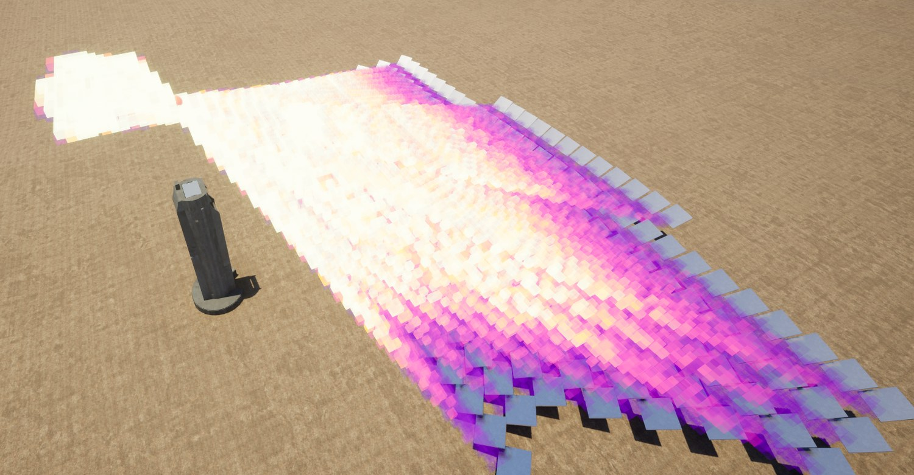                   |
| Radial field, point standby (top-down)       | 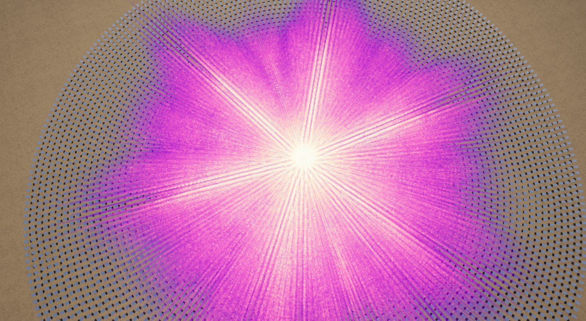 |

### Aim strategies
The model includes several aim strategies, and accepts per-heliostat CSV files for custom configurations.

| Strategy | Description | Figure |
|----------|-------------|--------|
| Single-point | All heliostats aim at one location; flux converges into a concentrated column | 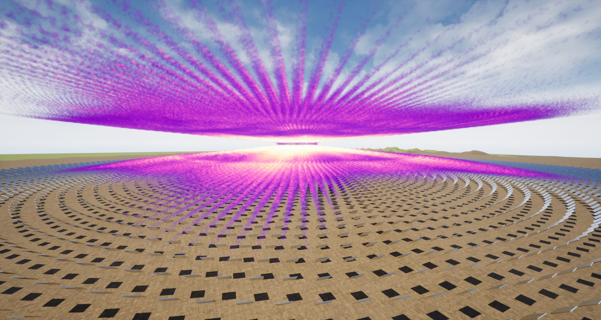 |
| Ring | Aim distributed around an annulus above the tower; flux forms a broader elevated region | 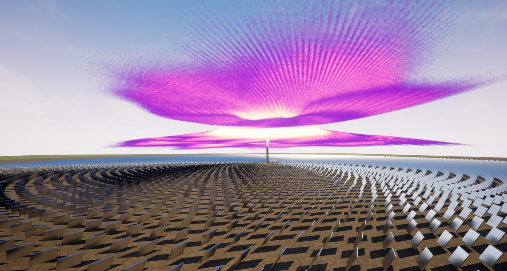 |
| Split-ring | Each azimuthal slice fans across the annulus, redistributing flux around the receiver | 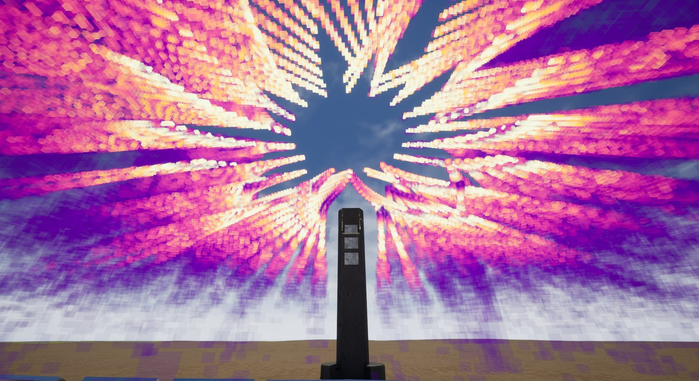 |
| Constant-vector | All heliostats aim in a fixed direction (e.g. stow); flux spreads across the field | 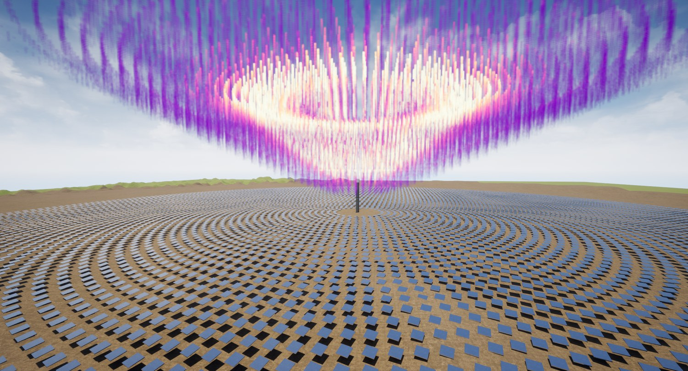 |

### Voxel resolution

The airspace is partitioned into voxels. Default resolution is 2 m/side, an 8x improvement in per-voxel volume over the original 4 m.
Depending on memory constraints, smaller sites can be set to 1 m voxel resolution.

| View                            | Figure |
|---------------------------------|--------|
| 4 m voxels (opaque for clarity) | 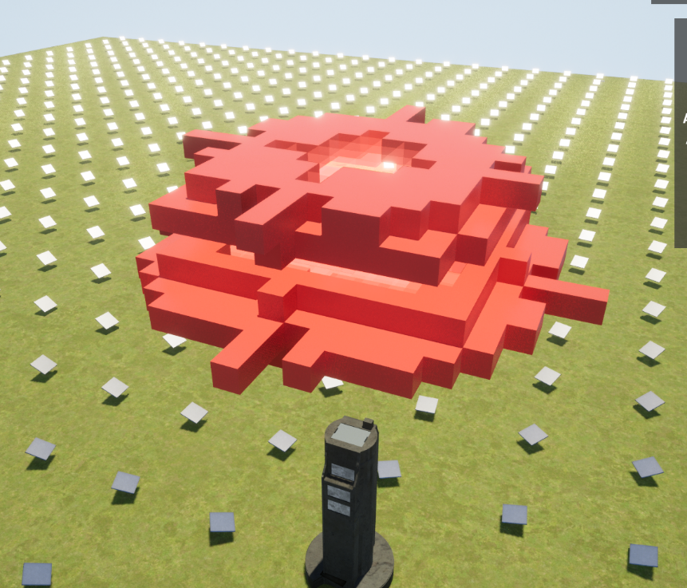 |
| 2 m voxels                      | 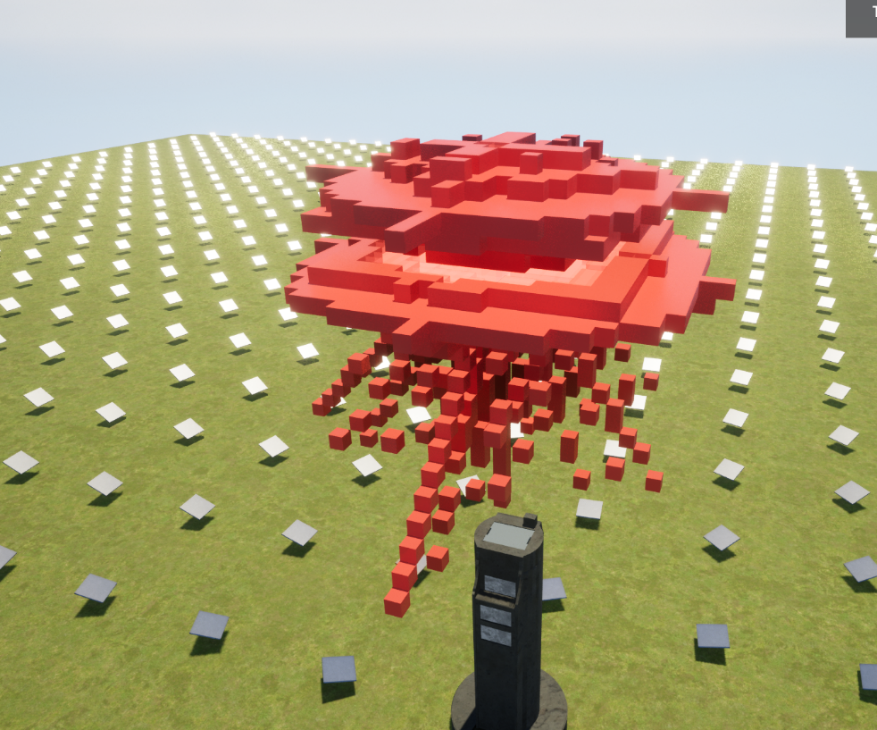 |
| 1 m voxels, flux detail         |  |

## Data flow

A Python module (`pyffiam`) that runs streamlined analyses and generates heatmap and profile charts plus tabulated summary tables, suitable for reports and presentations. It wraps the same C++/CUDA library as the Visualization flow.

### Volumetric voxel irradiance

Irradiance is resolved through the 3D volume and viewable in any cardinal plane (east-north, north-up, east-up).

| View | Figure |
|------|--------|
| NSTTF, plan (east-north) |  |
| NSTTF, elevation (north-up) | 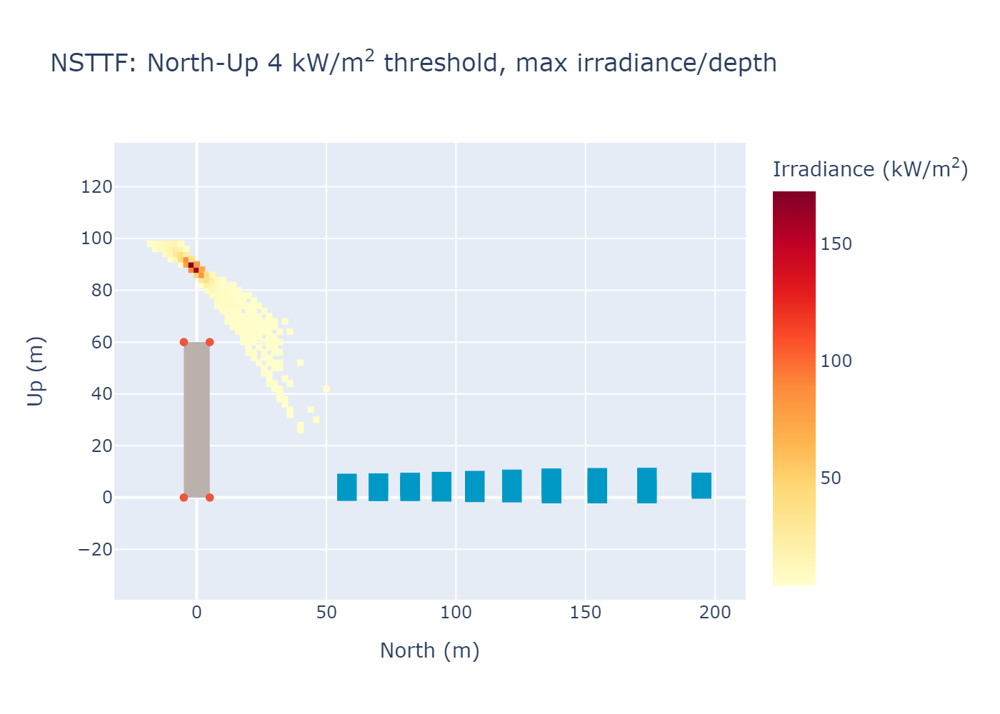 |
| NSTTF, hotspot zoom | 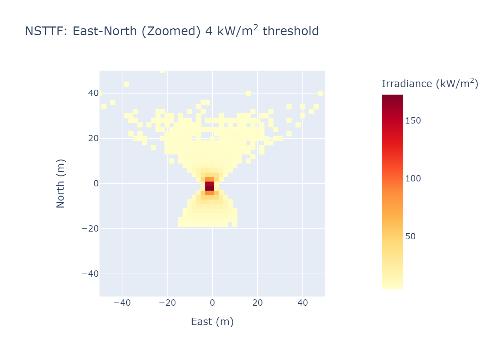 |

### Time-resolved animation

Fields are computed across solar position and rendered as animations. The high-irradiance region moves as the sun moves.

| View | Figure |
|------|--------|
| NSTTF, east-north | 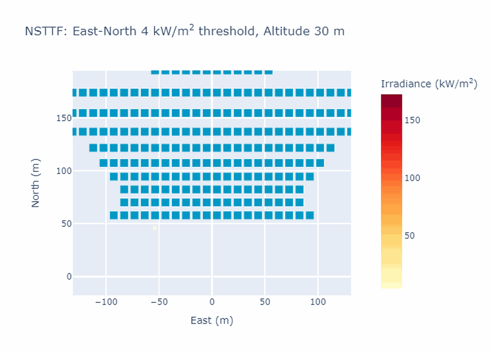 |
| NSTTF, east-up |  |
| SampleV1, east-north |  |

### Flight-path irradiance and radiant exposure

FFIAM evaluates irradiance along a polyline path. The user gives (east, north, up) vertices and an average velocity per path. It reports instantaneous irradiance and cumulative radiant exposure (dose) over time, for airspace-safety work.

| View | Figure |
|------|--------|
| Irradiance along a path | 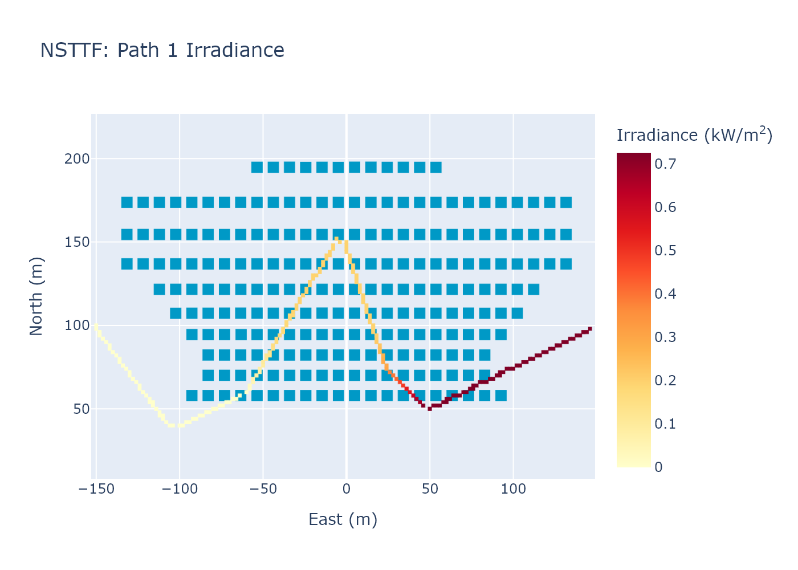 |
| Radiant exposure (dose) along a path |  |

### Site presets

The pipeline runs the real NSTTF field, synthetic SampleV1/V2/V3 sites, and parametric Radial fields. Users can reproduce these or load their own field via CSV/JSON.

| View | Figure |
|------|--------|
| SampleV1, east-up |  |
| SampleV1, hotspot zoom |  |

## Scale

V3.0 handles a 1.6 km field radius, 300 m airspace height, over 11,000 heliostats, and 300 million voxels per analysis at 2 m resolution, with 5 rays per heliostat facet.

## Reproducing these results

Data-flow figures are generated by examples in [`pyffiam/src/pyffiam/examples.py`](../pyffiam/src/pyffiam/examples.py):

- `assess_nsttf()`: real NSTTF field (volumetric, animation)
- `assess_radial_small()`: parametric radial field, runnable baseline (presets)
- `assess_sample_v2()`: synthetic site (presets)
- `assess_radial()`: full-size radial field (1.6 km, 10,000 heliostats)

See [`README.md`](../README.md) for install and usage, and [`PYFFIAM-GUIDE.md`](../PYFFIAM-GUIDE.md) for the Python API.
