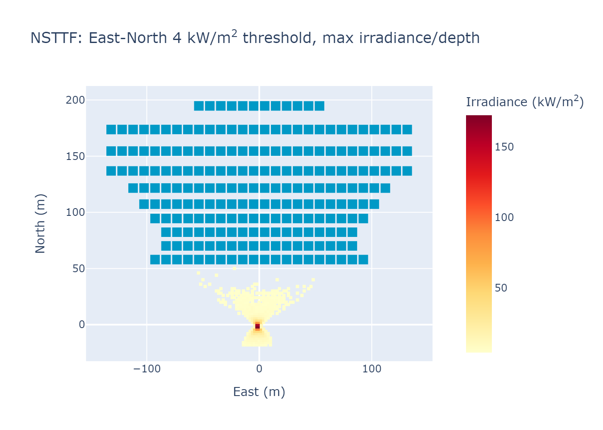
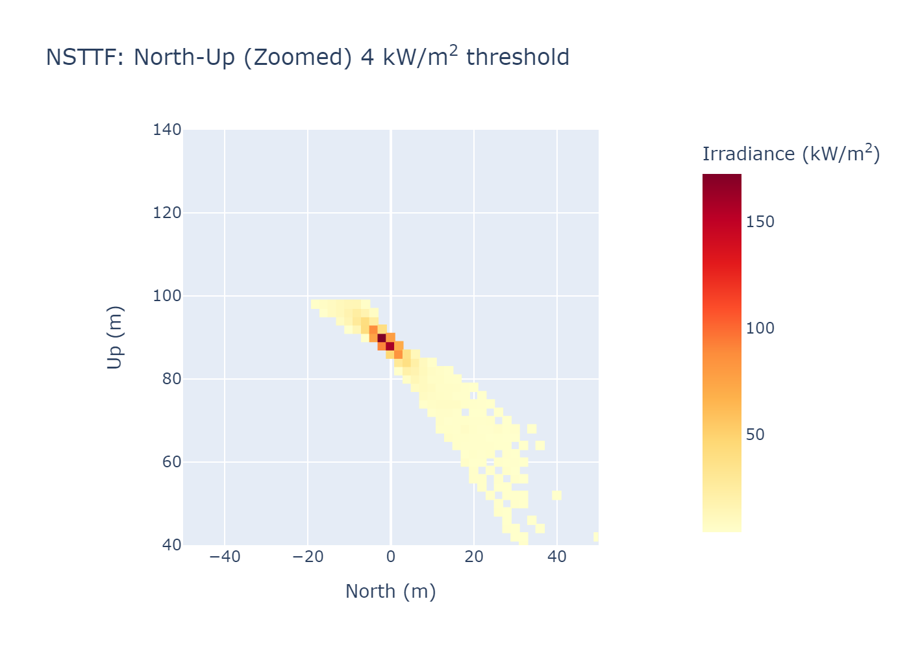
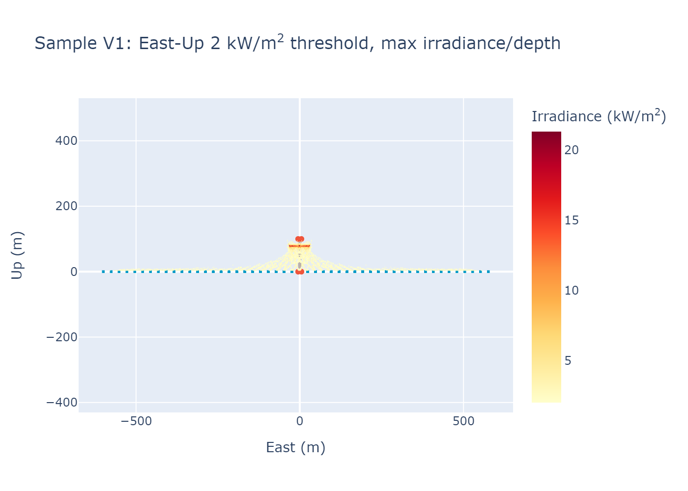
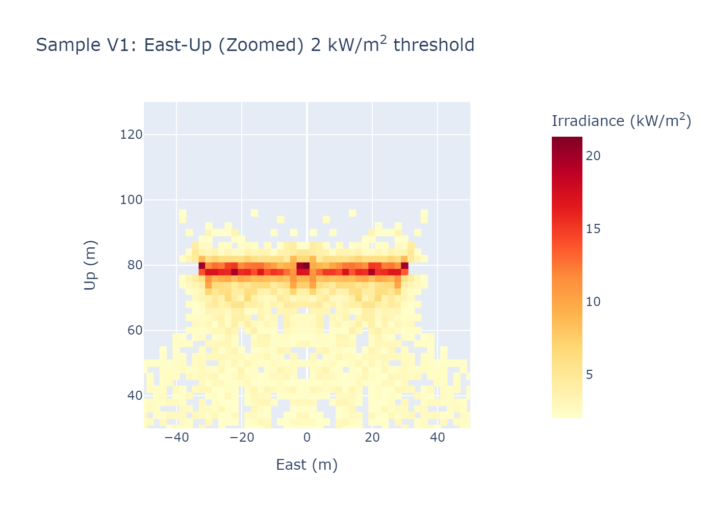
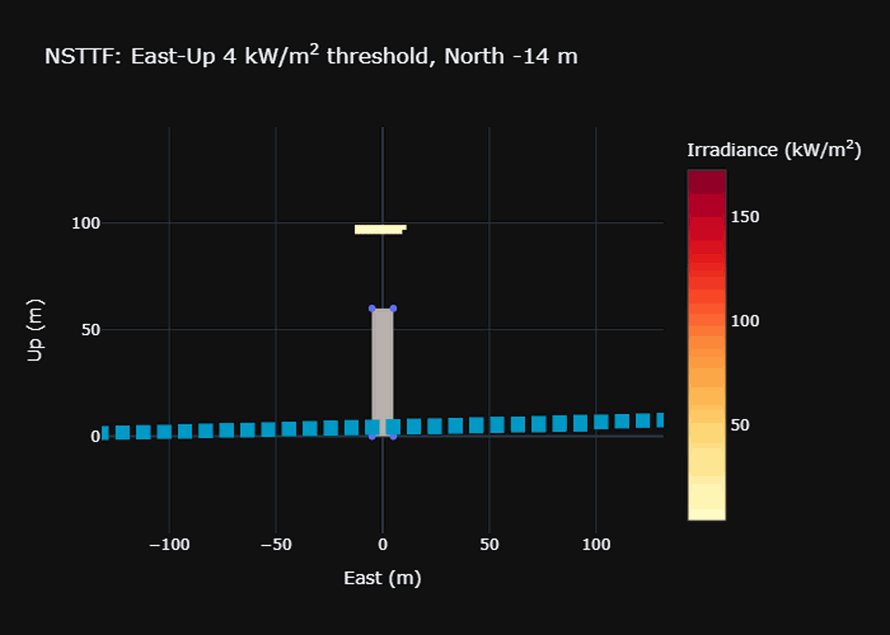
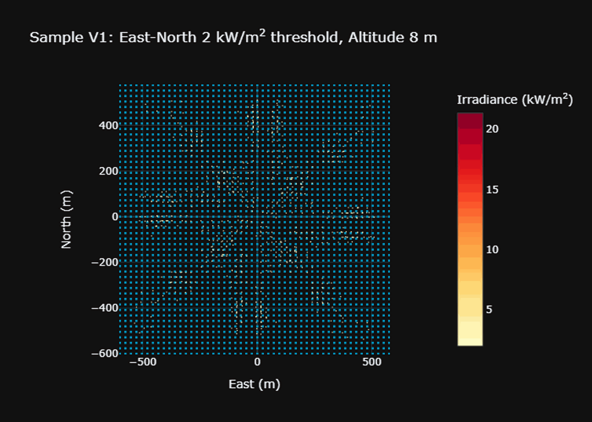
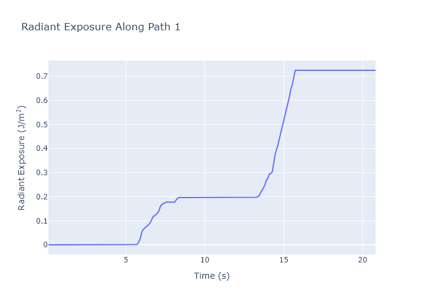
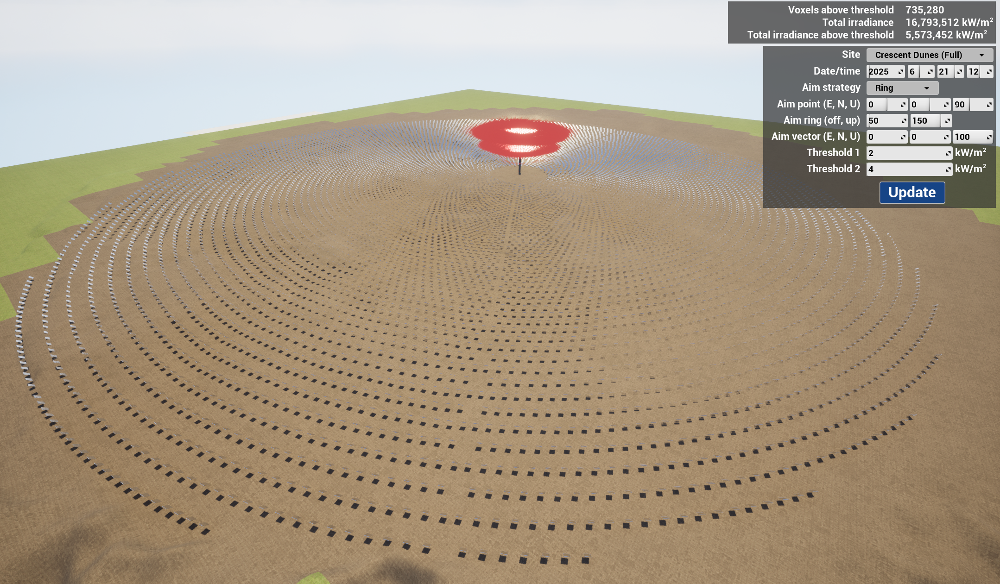
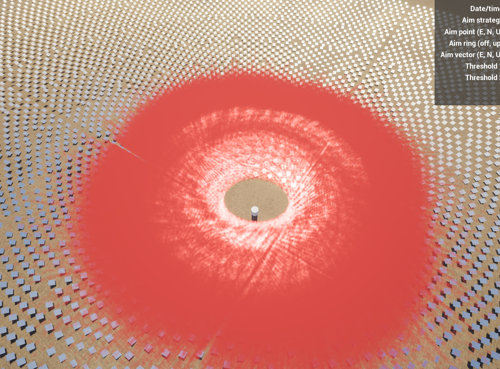
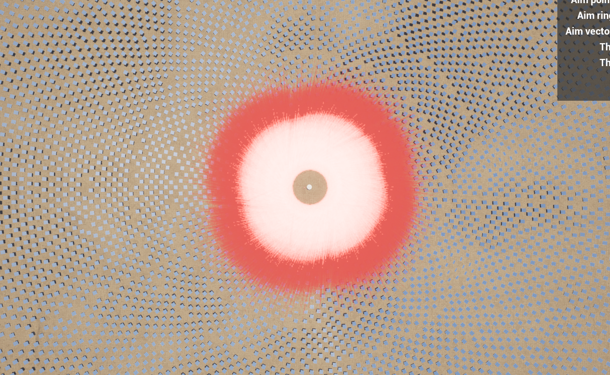

# FFIAM

FFIAM provides various tools to conduct volumetric analyses of irradiance from Concentrating Solar Plants ("CSP") during standby.
With FFIAM you can:
* visualize the irradiance over a heliostat field in 3D
* assess key data such as location(s) of high irradiance
* generate voxel-scatter plots and tabular summaries of analysis results

FFIAM v3.0 is available as a command-line python and C++ tool.


## Introduction

FFIAM assesses the irradiance impacting an airspace by partitioning the volume of space into cubes, called *voxels*,
and then computing the total amount of irradiance affecting each voxel.
The irradiance from each heliostat is computed by simulating reflected sunlight on a facet-by-facet basis.
Each heliostat is described by characteristics such as focal length and facet size.

FFIAM offers two workflows:
* the **Analysis** workflow assesses the CSP airspace and paths for irradiance and generates plots, data files, and even GIFs of the irradiance results.
* the **Visualization** workflow uses Unreal Engine to simulate the CSP field and high-irradiance voxels. The user can directly navigate the 3D representation.

The following inputs are used during analysis:

* **CSP field** properties including the site location, heliostat layout, and airspace boundaries.
* **Day/time** parameters for computing the sun's position and resulting heliostat aim points.
* **Aim strategy** inputs such as the type of standby behavior (point, ring, vector) and strategy-dependent properties.


## Installation (Windows)
FFIAM is developed on Windows 10/11. For an alternative setup using Docker, see [Docker (Linux Container)](#docker-linux-container). FFIAM contains two components in this repository:
1. The C++ analysis library, located in the `ffiam` directory, contains the CUDA and related source code for conducting an analysis
2. The python wrapper module, located in the `pyffiam` directory, wraps the C++ library and provides the **Analysis** workflow functionality

The **Visualization** workflow is provided by a separate Unreal Engine project. See [FFIAM with Unreal Engine](#ffiam-with-unreal-engine) for details.

The setup below assumes familiarity with CMake, Python, and an IDE like Microsoft Visual Studio.

### A. Set up Microsoft Visual Studio
Install a recent version of MSVS (tested with 2019 and 2022) from the [MSVS website](https://visualstudio.microsoft.com/).

### B. Download and install CUDA 12
CUDA is a free toolkit by Nvidia. Download it from the [CUDA website](https://developer.nvidia.com/cuda-toolkit).

Make sure `cl.exe` is on your PATH. It will be in a directory like:

    C:\Program Files\Microsoft Visual Studio\2022\Professional\VC\Tools\MSVC\14.43.34808\bin\hostx64\x64\

Use the MSVS toolchain for building FFIAM with CMake. FFIAM has not been tested with MinGW.


### C. Set up Python
pyffiam requires Python >= 3.10, available from the [Python website](https://www.python.org/).
Using a [virtual environment](https://docs.python.org/3/library/venv.html) is strongly recommended.

Install pyffiam and its dependencies from the `pyffiam` directory:

    pip install -e .

To include development dependencies (pytest, mypy):

    pip install -e ".[dev]"

### D. Set Up FFIAM Repository

Clone the FFIAM repository to a location of your choice:

    git clone https://gitlab-ex.sandia.gov/casims/ffiam.git
    cd ffiam

### E. Build the C++ Library

Navigate to the `ffiam` directory and build with CMake:

    cd ffiam
    cmake -G "Visual Studio 17 2022" -A x64 -B build_vs
    cmake --build build_vs --config Release

This builds all targets and automatically copies `ffiam_lib.dll` to `pyffiam/src/pyffiam/external/`.

To run the unit tests:

    build_vs\bin\Release\ffiam_tests.exe

### F. Test the Installation

Navigate to the `pyffiam/src` directory and run the `examples.py` script to test that the setup was successful.

    cd pyffiam/src
    python -m pyffiam.examples


## Running without a GPU

The build produces two shared libraries:

- `ffiam_lib` — CUDA-accelerated. Requires `cudart64_12.dll` (Windows) or
  `libcudart.so.12` (Linux) and a working NVIDIA GPU.
- `ffiam_lib_cpu` — CPU-only fallback. No CUDA dependency at link or run
  time. Build it with `cmake --build build_vs --config Release --target ffiam_lib_cpu`.

`pyffiam` tries to load the CUDA library first. If the CUDA runtime cannot
be located (or the GPU lib fails to load for any reason) it falls back to
the CPU library and prints a banner to stderr. The CPU backend is
feature-equivalent (asymmetric pre-focal attenuation, configurable exponent,
full 9-ray grid + outer tilted rays, piecewise flux correction) but runs
roughly 50-200x slower than CUDA on typical workloads.

### Forcing the CPU backend

Useful for testing on machines with a GPU, or where the GPU lib is
unavailable for non-CUDA reasons:

```python
from pyffiam.analysis import analysis
result = analysis(..., force_cpu=True)
```

Or via environment variable:

```powershell
$env:FFIAM_FORCE_CPU = "1"
python my_script.py
```

### OpenMP

The CPU backend uses OpenMP to parallelize the heliostat loop when it's
available at build time. MSVC 2019/2022 and recent gcc/clang all ship
OpenMP support; CMake's `find_package(OpenMP)` picks it up automatically.
If OpenMP isn't found the build falls back to a single-threaded CPU loop —
expect roughly Nx the wall time, where N is your usable core count.


## Docker (Linux Container)

FFIAM can run inside a Linux Docker container, which handles all build dependencies (CUDA, CMake, Python) automatically.
This is an alternative to the Windows setup above.

### Prerequisites

You need:
1. An NVIDIA GPU with CUDA 12+
2. [Docker Desktop](https://www.docker.com/products/docker-desktop/) with the WSL 2 backend (on Windows), or Docker Engine (on Linux)
3. [NVIDIA Container Toolkit](https://docs.nvidia.com/datacenter/cloud-native/container-toolkit/latest/install-guide.html) installed in your WSL/Linux environment

On Windows, enable WSL integration in Docker Desktop under Settings > Resources > WSL integration.

### Build the Container

From the repository root:

```bash
docker build -t ffiam .
```

This compiles the C++ library and installs pyffiam into a ~4 GB Linux image.
The first build takes a few minutes; rebuilds use cached layers.

### Run an Analysis

Use `--gpus all` to give the container access to the host GPU (required for CUDA):

```bash
docker run --rm --gpus all ffiam -c "
from pyffiam.analysis import analysis
from pyffiam.ffiam_types import CspSite, AimType
import numpy as np

result = analysis(site=CspSite.NSTTF,
                  aim_strat=AimType.Point,
                  aim_params=np.array([0, 0, 90]),
                  threshold=4,
                  create_xls=False)
print(f'Total irradiance: {result.total_irrad:,.0f}')
"
```

To open an interactive shell inside the container:

```bash
docker run --rm -it --gpus all --entrypoint bash ffiam
```

### Retrieving Output Files

Analysis output is written inside the container. To access files on the host, mount a directory with `-v`:

```bash
docker run --rm --gpus all -v /path/on/host:/output ffiam -c "
from pyffiam.analysis import analysis
from pyffiam.ffiam_types import CspSite, AimType
import numpy as np

result = analysis(site=CspSite.NSTTF,
                  aim_strat=AimType.Point,
                  aim_params=np.array([0, 0, 90]),
                  threshold=4,
                  create_plots=True,
                  create_xls=True,
                  output_dir='/output')
"
```

Plots and Excel files will appear in `/path/on/host`.

### Quick Start Examples

The examples below use `-v $(pwd)/output:/output` to save results to an `output/` folder in your current directory. All produce heatmap plots and an Excel summary.

**NSTTF, Point aim at 90 m (218 heliostats, Sandia's test facility):**

```bash
docker run --rm --gpus all -v $(pwd)/output:/output ffiam -c "
from pyffiam.analysis import analysis
from pyffiam.ffiam_types import CspSite, AimType
import numpy as np

result = analysis(site=CspSite.NSTTF,
                  aim_strat=AimType.Point,
                  aim_params=np.array([0, 0, 90]),
                  threshold=4,
                  create_plots=True, create_xls=True, create_gifs=False,
                  open_output_dir=False, output_dir='/output')
print(f'Peak: {result.peak_irrad:,.1f} kW/m2, Glaring voxels: {result.n_glaring_voxels:,}')
"
```

**NSTTF, Ring aim (heliostats aim at a ring around the tower instead of a single point):**

```bash
docker run --rm --gpus all -v $(pwd)/output:/output ffiam -c "
from pyffiam.analysis import analysis
from pyffiam.ffiam_types import CspSite, AimType
import numpy as np

# Ring params: (inner_radius=30m, outer_radius=90m, height=0 unused)
result = analysis(site=CspSite.NSTTF,
                  aim_strat=AimType.Ring,
                  aim_params=np.array([30, 90, 0]),
                  threshold=4,
                  create_plots=True, create_xls=True, create_gifs=False,
                  open_output_dir=False, output_dir='/output')
print(f'Peak: {result.peak_irrad:,.1f} kW/m2 (lower than Point, flux is distributed)')
"
```

**Crescent Dunes, full site, 10,348 heliostats:**

```bash
docker run --rm --gpus all -v $(pwd)/output:/output ffiam -c "
from pyffiam.analysis import analysis
from pyffiam.ffiam_types import CspSite, AimType
import numpy as np

result = analysis(site=CspSite.CrescentDunes,
                  aim_strat=AimType.Point,
                  aim_params=np.array([0, 0, 100]),
                  threshold=4,
                  create_plots=True, create_xls=True, create_gifs=False,
                  open_output_dir=False, output_dir='/output')
print(f'Total irradiance: {result.total_irrad:,.0f} kW')
print(f'Peak: {result.peak_irrad:,.1f} kW/m2, Glaring voxels: {result.n_glaring_voxels:,}')
"
```

**Crescent Dunes, Vector aim (all heliostats aim straight up, simulating stow):**

```bash
docker run --rm --gpus all -v $(pwd)/output:/output ffiam -c "
from pyffiam.analysis import analysis
from pyffiam.ffiam_types import CspSite, AimType
import numpy as np

# Vector params: unit direction (0, 0, 1) = straight up
result = analysis(site=CspSite.CrescentDunes,
                  aim_strat=AimType.Vector,
                  aim_params=np.array([0, 0, 1]),
                  threshold=4,
                  create_plots=True, create_xls=True, create_gifs=False,
                  open_output_dir=False, output_dir='/output')
print(f'Peak: {result.peak_irrad:,.1f} kW/m2 (minimal, heliostats pointing away from field)')
"
```

**Custom site, morning analysis with path assessment:**

```bash
docker run --rm --gpus all -v $(pwd)/output:/output ffiam -c "
from pyffiam.analysis import analysis
from pyffiam.ffiam_types import CspSite, AimType
import numpy as np

result = analysis(site=CspSite.NSTTF,
                  year=2025, month=8, day=8, hour=10.5,
                  aim_strat=AimType.Point,
                  aim_params=np.array([0, 0, 90]),
                  threshold=4,
                  paths=[[[-50, 100, 60], [50, 100, 60], [50, 200, 60], [-50, 200, 60]]],
                  path_speeds=[15],
                  create_plots=True, create_xls=True, create_gifs=False,
                  open_output_dir=False, output_dir='/output')
print(f'Path max irradiance: {max(result.path_results[0].irradiances):.1f} kW/m2')
"
```

#### Available Sites

| Site | Heliostats | Field radius | Description |
|------|-----------|-------------|-------------|
| `CspSite.NSTTF` | 218 | 600 m | Sandia's National Solar Thermal Test Facility |
| `CspSite.CrescentDunesSmall` | 6,400 | 1,000 m | 1 km annular section of Crescent Dunes |
| `CspSite.CrescentDunes` | 10,348 | 1,600 m | Full Crescent Dunes Solar facility |
| `CspSite.SampleV1` | 1,936 | 600 m | Generic field (~2k heliostats) |
| `CspSite.SampleV2` | 6,400 | 1,000 m | Generic field (~6k heliostats) |
| `CspSite.SampleV3` | 11,025 | 1,600 m | Generic field (~11k heliostats) |

#### Aim Strategies

| Strategy | Params (X, Y, Z) | Description |
|----------|-------------------|-------------|
| `AimType.Point` | (east, north, up) position in meters | All heliostats aim at a single point |
| `AimType.Ring` | (inner_radius, outer_radius, 0) | Heliostats distribute aim around a ring at tower height |
| `AimType.Vector` | (x, y, z) unit direction | All heliostats aim in a fixed direction (e.g., stow = 0,0,1) |
| `AimType.CsvData` | (0, 0, 0) + `aim_file` | Per-heliostat aim angles from CSV |


## Using FFIAM

The FFIAM repository comprises both the C++ analysis library and the pyffiam package, which provides a convenient
interface for conducting analyses:

    ├───docs
    ├───ffiam (C++ library)
    │   ├───include/ffiam/     # Public API headers
    │   ├───src/
    │   │   ├───compute/       # Irradiance computation (CUDA/CPU)
    │   │   ├───core/          # Constants, heliostat, voxel
    │   │   ├───solar/         # Solar position calculations
    │   │   ├───io/            # CSV file parsing
    │   │   ├───api/           # Preset site configurations
    │   │   ├───memory/        # Memory pool and RAII wrappers
    │   │   └───util/          # Math, CUDA utils, paths, errors
    │   ├───tests/             # Unit tests
    │   ├───data/
    │   └───external/          # Third-party (fmt, solpos)
    └───pyffiam (wrapper module)
        ├───src/pyffiam/
        │   ├───analysis.py        # Main entry point
        │   ├───analysis_data.py   # Legacy data container
        │   ├───config.py          # Configuration dataclasses
        │   ├───results.py         # Results dataclasses
        │   ├───cpp_interface.py   # C++ library interface
        │   ├───plots.py           # Visualization generation
        │   ├───xls.py             # Excel output generation
        │   ├───utils.py           # Utility functions
        │   ├───ffiam_types.py     # Enums and type definitions
        │   ├───data/
        │   ├───external/          # ffiam_lib.dll / libffiam_lib.so (auto-copied from build)
        │   └───site_configs/      # Preset and loaded configurations
        └───tests/                 # Unit and integration tests

Analyses are primarily conducted by calling the `analysis` function in `analysis.py` and supplying it with
parameters describing the CSP site under analysis.
When run, `analysis` loads the FFIAM library, computes the airspace
irradiance, and generates the requested output data and files.
Examples of analyzing both preset and custom sites are provided in the
[Example Usage](#example-usage) section.

Refer to the [`analysis` docstring](pyffiam/src/pyffiam/analysis.py) for a detailed description of each analysis input parameter.


### Analysis Results

FFIAM analysis results include both data outputs and visualizations ready for presentation.
FFIAM generates irradiance data for voxels impacted by "glaring" heliostats.
This data is accessible via the C++ or python function calls and can be further used programmatically.

Each analysis also creates a summary of analysis results via a .XLSX Excel worksheet.
This file tabulates the analysis parameters, field data, and irradiance results.
The analysis plots described below are also contained in the data file.


#### Analysis Plots
pyffiam analyses generate voxel-scatter charts which visualize impacted voxels according to their received irradiance.
Charts are generated for each axis pair and include East-North (XY), East-Up (XZ), and North-Up (YZ).
"Zoomed in" versions of each plot are also created. Zoomed plots are cropped to the aim point/ring location to provide
additional detail.

<p float="left">
    
    
</p>

*East-North plots of NSTTF with Point aim strategy*

The voxel-scatter charts display the highest predicted irradiance for each voxel "depth".
For example, the East-North chart displays the maximum irradiance predicted along the
**vertical (Up)** dimension for each East-North voxel coordinate.


<p float="left">
<br />
    
    
</p>

*North-Up plots of NSTTF with Point aim strategy*

<p float="left">
<br />
    
    
</p>

*East-Up plots of generic 2,500-heliostat field with Ring aim strategy*

<br />

pyffiam can also compile gifs of each chart which animate irradiance behavior of the excluded axis.
For example, the East-North gif starts at Z (elevation) = 0 and increases it voxel-by-voxel.

*Note: gif generation is time-consuming and can take several minutes for larger sites*

<p float="left">
    
</p>
<p float="left">
    
</p>


## Example Usage
This section demonstrates how to use the `analysis` function to evaluate both preset sites and custom CSP sites.


### Evaluating a Preset Site

FFIAM includes several predefined sites which can be used to demonstrate the tool's functionality.
Sample data includes:
* The National Solar Thermal Test Facility ("NSTTF")
* A generic CSP field comprising ~1,900 heliostats ("SampleV1")

To conduct an analysis of a preset site, import the main analysis function and input the site, aim parameters,
and output selections:

    from pyffiam.analysis import analysis
    from pyffiam.ffiam_types import CspSite, AimType
    import numpy as np


    preset_results = analysis(site=CspSite.NSTTF,
                              aim_strat=AimType.Point,
                              aim_params=np.array([0, 0, 90]),
                              threshold=4,
                              create_plots=True,
                              create_gifs=True,
                              create_xls=True)


### Evaluating a Custom Site with a Generic Layout

Analysis of a custom CSP site is also available via the pyffiam `analysis` function.
Call the `analysis` function with the `site` parameter set to `Custom`.
Then define the relevant parameters for your site.
If the data-file parameters are not used, FFIAM will simulate a generic, uniform layout.

    from pyffiam.analysis import analysis
    from pyffiam.ffiam_types import CspSite, AimType
    import numpy as np


    custom_results = analysis(site=CspSite.Custom,
                              year=2024,
                              month=4,
                              day=15,
                              hour=14,
                              threshold=4,
                              lat=34.96348,
                              lng=-106.50964,
                              aim_strat=AimType.Ring,
                              aim_params=np.array([30, 120, 0]),
                              create_plots=True,
                              create_gifs=False,
                              create_xls=True)

### Evaluating a Custom Site with Imported Layout

Heliostat and facet positions can be imported from .CSV files for enhanced accuracy.
The example below repeats the custom site analysis but uses imported data rather than generic computed positions.

The data-files must be placed within the `pyffiam/data` directory.
Note that the Cartesian data for each must be positioned on columns B, C, and D, and begin on row 2.

    from pyffiam.analysis import analysis
    from pyffiam.ffiam_types import CspSite, AimType
    import numpy as np


    csv_results = analysis(site=CspSite.Custom,
                           year=2024,
                           month=4,
                           day=15,
                           hour=14,
                           threshold=4,
                           lat=34.96348,
                           lng=-106.50964,
                           aim_strat=AimType.Ring,
                           aim_params=np.array([30, 120, 0]),
                           helio_file="demo_NSTTF_Heliostats.csv",
                           facet_file = "demo_NSTTF_Facet_Centroids.csv",
                           create_plots=True,
                           create_gifs=False,
                           create_xls=True)

### Evaluating Paths
The analysis function can also assess the irradiance received along paths through the airspace.
To assess one or more paths, provide the `paths` argument with a nested list of vertices comprising each path.
The analysis will determine the impacted voxels throughout the path and will generate plots describing the cumulative irradiance
along the path, as well as the radiant exposure over time.

<p float="left">
    
    
</p>

*Path analysis plot outputs*


### Running Analysis from a Configuration File

pyffiam can run analyses defined in JSON configuration files. This is useful for batch processing multiple site configurations or sharing analysis setups between users.

Configuration files are placed in the `pyffiam/src/pyffiam/site_configs/loaded/` directory. Any `.json` file in this directory will be processed when running the analysis script.

To run all loaded configurations:

    cd pyffiam/src
    python -m pyffiam.run_site_analysis_from_file

#### JSON Configuration Format

Configuration files support both preset sites and custom configurations. A minimal preset site configuration:

```json
{
  "RunId": "NSTTF Summer Solstice",
  "SiteType": "Site_Nsttf",
  "Threshold": 4,
  "DateTime": {
    "Year": 2025,
    "Month": 6,
    "Day": 21,
    "Hour": 12
  },
  "AimStrategy": {
    "Type": "Aim_Point",
    "Params": { "X": 0.0, "Y": 0.0, "Z": 90.0 }
  }
}
```

A custom site configuration requires additional sections:

```json
{
  "RunId": "Custom Site Analysis",
  "SiteType": "Site_Custom",
  "Threshold": 4,
  "HelioDesign": {
    "NumFacets": 25,
    "NumCols": 5,
    "FacetWidth": 1.2,
    "FacetHeight": 1.2,
    "FacetFile": "",
    "bFacetsImported": false
  },
  "Field": {
    "Latitude": 34.96,
    "Longitude": -106.51,
    "Timezone": -7.0,
    "FieldRadius": 600,
    "MinHeight": 4,
    "MaxHeight": 200,
    "TowerPos": { "X": 0.0, "Y": 0.0, "Z": 0.0 },
    "TowerHeight": 90.0,
    "VoxelSize": 2,
    "NumHelios": 218,
    "HelioCoordinateFile": ""
  },
  "DateTime": {
    "Year": 2025,
    "Month": 6,
    "Day": 21,
    "Hour": 12
  },
  "AimStrategy": {
    "Type": "Aim_Ring",
    "Params": { "X": 30.0, "Y": 120.0, "Z": 0.0 },
    "File": ""
  },
  "create_gifs": false,
  "Paths": [
    {
      "Name": "East-west transect at 70 m",
      "Points": [[-100, 100, 70], [100, 100, 70]],
      "Speed": 15
    }
  ]
}
```

#### Configuration Fields

| Field | Description |
|-------|-------------|
| `RunId` | Descriptive name for the analysis run |
| `SiteType` | `Site_Nsttf`, `Site_CrescentDunes`, `Site_CrescentDunesSmall`, `Site_Custom`, etc. |
| `Threshold` | Minimum irradiance threshold (kW/m²) for glare reporting |
| `HelioDesign.NumFacets` | Total facets per heliostat |
| `HelioDesign.NumCols` | Facet grid columns (rows = NumFacets / NumCols) |
| `HelioDesign.FacetWidth/Height` | Facet dimensions (m) |
| `HelioDesign.FacetFile` | CSV filename for imported facet centroids (blank = generate grid) |
| `Field.Latitude/Longitude` | Site location (decimal degrees) |
| `Field.Timezone` | UTC offset (hours) |
| `Field.FieldRadius` | Analysis airspace radius (m) |
| `Field.MinHeight/MaxHeight` | Altitude bounds (m) |
| `Field.TowerPos` | Tower position {X, Y, Z} in meters (UE visualization only; pyffiam uses origin) |
| `Field.TowerHeight` | Tower height to receiver (m) |
| `Field.VoxelSize` | Voxel side length (m) (UE visualization only; pyffiam defaults to 2m via `voxel_size` param) |
| `Field.NumHelios` | Number of heliostats |
| `Field.HelioCoordinateFile` | CSV filename for imported heliostat positions (blank = generate layout) |
| `DateTime` | Year, Month, Day, Hour (fractional hours supported, e.g. 10.5 = 10:30 AM) |
| `AimStrategy.Type` | `Aim_Point`, `Aim_Ring`, `Aim_Vector`, or `Aim_CsvData` |
| `AimStrategy.Params` | Strategy-specific parameters {X, Y, Z} |
| `AimStrategy.File` | CSV filename for per-heliostat aim data (used with `Aim_CsvData`) |
| `Paths` | Optional list of flight paths, each with `Name`, `Points` ([[x,y,z],...]), and `Speed` (m/s) |
| `create_gifs` | Set to `true` to generate animated GIFs |

Inactive configurations can be moved to the `unloaded/` directory to exclude them from batch processing.


## FFIAM with Unreal Engine

The **Visualization** workflow uses Unreal Engine 5.5 to render CSP fields and irradiance results in an interactive 3D environment. Users can navigate the field, adjust analysis parameters in real-time, and observe how different aim strategies affect the irradiance distribution.

<p float="left">
    
</p>

*Unreal Engine visualization showing a CSP field with ring aim strategy. The red volume indicates voxels exceeding the irradiance threshold.*

<p float="left">
    
    
</p>

*Close-up and top-down views of the ring aim irradiance pattern around the receiver tower.*

### Visualization Features

The Unreal Engine interface provides:
* Real-time parameter adjustment via an interactive UI panel
* Multiple aim strategy visualization (Point, Ring, Vector)
* Configurable irradiance thresholds with live updates
* Two levels of voxel detail for performance optimization
* Support for preset and custom site configurations

### Separate Repository

The Unreal Engine visualization project is maintained in a separate repository due to its size and different build requirements. The project integrates with the FFIAM C++ library via DLL linking.

To use the visualization workflow:
1. Build the FFIAM C++ library as described above
2. Clone the IrradianceGui repository
3. Open `Irradiance.uproject` in Unreal Engine 5.5
4. The project will automatically link against the FFIAM library

Contact the project maintainers for access to the visualization repository.


## License

FFIAM is proprietary software owned by Sandia National Laboratories.
Use is restricted to authorized users only.
See [LICENSE.md](LICENSE.md) for full terms and conditions.


## Running Tests

Both the C++ library and pyffiam include test suites.

### C++ Tests

    cd ffiam
    cmake --build build_vs --config Release
    build_vs\bin\Release\ffiam_tests.exe

### Python Tests

    cd pyffiam
    python -m pytest tests/ -v

To run with coverage:

    python -m pytest tests/ -v --cov=pyffiam

### Docker Parity Tests

`tests/test_docker_parity.py` runs the same analyses natively and inside the Docker container, then compares peak irradiance, total irradiance, glaring voxel counts, and heliostat/facet counts. Five cases are covered: NSTTF (Point, Ring), SampleV1 (Point), and Crescent Dunes (Point, stow Vector). A 0.5% relative tolerance accommodates cross-platform numeric drift (MSVC/arch52 vs GCC/arch75+).

Prerequisites:
1. Native build complete (`ffiam_lib.dll` present in `pyffiam/src/pyffiam/external/`)
2. Docker image built: `docker build -t ffiam .`
3. Docker with NVIDIA Container Toolkit available on the host

Run all cases:

    cd pyffiam
    python -m pytest tests/test_docker_parity.py -v -s

Run a single case:

    python -m pytest tests/test_docker_parity.py -v -s -k nsttf_point

The `-s` flag is required to see the per-metric comparison table (native vs Docker with diff%). The `pyproject.toml` pytest config enables `log_cli` at WARNING level so the table streams to the terminal; if you see a `PASSED` line but no table, add `--log-cli-level=WARNING` to the invocation. The test auto-skips if the `ffiam` Docker image is not present or when executed inside a container.


## Release Notes

### Version Comparison

| Metric | V1.0 | V2.0 | V3.0 |
|--------|------|------|------|
| Field radius | 600 m | 1,000 m | 1,600 m |
| Airspace height | 100 m | 200 m | 300 m |
| Max heliostats | 2,000 | 6,400 | 11,000 |
| Voxel resolution | 4 m | 2 m | 2 m |
| Voxels per analysis | 2.25 million | 100 million | 300 million |
| Rays per facet | 1 | 5 | 5 |


### September 2025 - FFIAM v3.0

Field capacity expansion and codebase cleanup.

- Field radius up to 1,600 m (was 1,000 m), altitude to 300 m (was 200 m), up to 11,000 heliostats
- Full Crescent Dunes site (~10,400 heliostats) added as a preset
- JSON config import for batch runs via the `loaded/` directory
- C++ reorganized into `compute/`, `core/`, `solar/`, `io/`, `api/`, `memory/`, `util/`. RAII wrappers replace manual malloc/free. Unit tests added under `ffiam/tests/`
- pyffiam split into dedicated `config.py` and `results.py` dataclasses. ctypes isolated to `cpp_interface.py`. Excel generation moved into an `ExcelWriter` class. Type hints and pytest added throughout


### March 2025 - FFIAM v2.0

Capacity expansion, path analysis, and Unreal Engine visualization.

- Field radius up to 1,000 m (was 600 m), altitude to 200 m (was 100 m), up to 6,400 heliostats
- Voxel resolution 2 m (was 4 m), 5x more rays per facet
- Path analysis: irradiance and radiant exposure along polyline flight paths at configurable speeds
- UE 5.5 visualization with real-time parameter adjustment, hierarchical instanced meshes, and two-level voxel detail
- New presets: 1 km generic site (6,084 heliostats) and a 1 km annular section of Crescent Dunes (6,400 heliostats)
- Validated against SolTrace (aim-point slope 1.1, R² 0.8)


### March 2024 - FFIAM v1.0

Initial release.

- Field radius 600 m, altitude 100 m, up to 2,000 heliostats, 4 m voxels (2.25M voxels per analysis)
- CUDA computation of heliostat-to-voxel irradiance with CPU fallback
- Point, Ring, and Vector aim strategies
- SOLPOS-based solar position
- Voxel-scatter heatmaps (East-North, East-Up, North-Up) with zoomed variants
- Total, peak, and threshold-filtered metrics
- Presets: NSTTF and a generic 2,000-heliostat site
- CSV import for heliostat and facet positions
